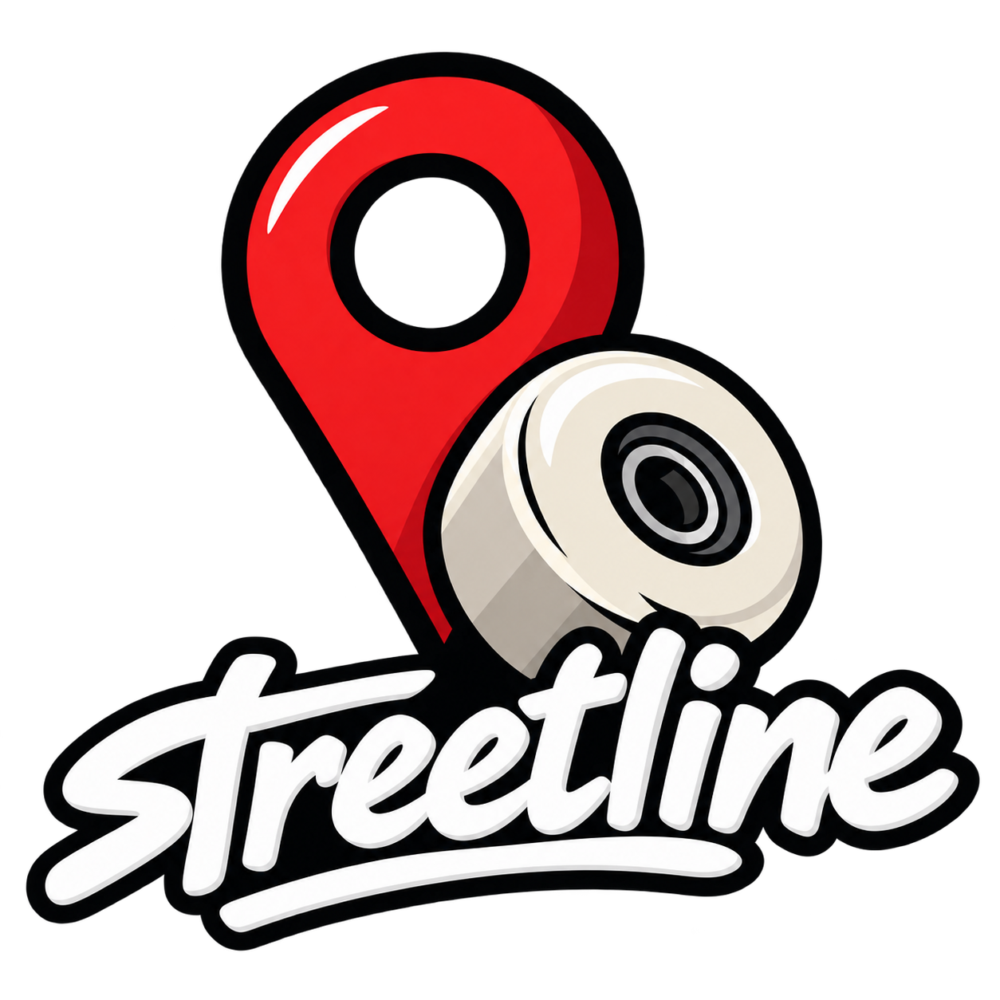
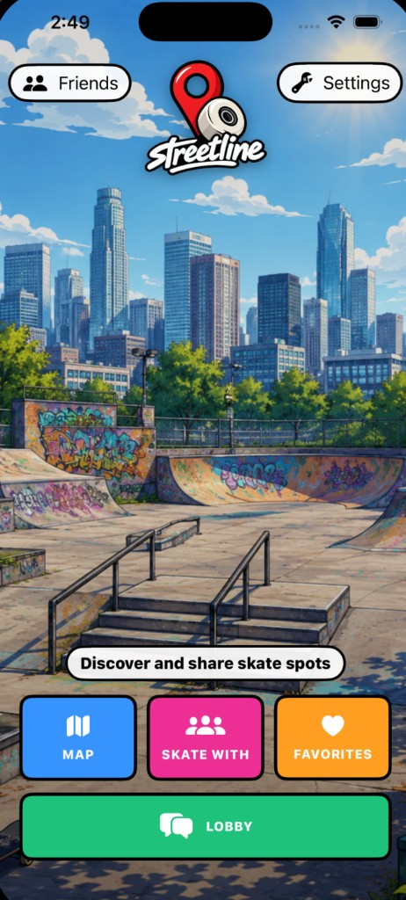
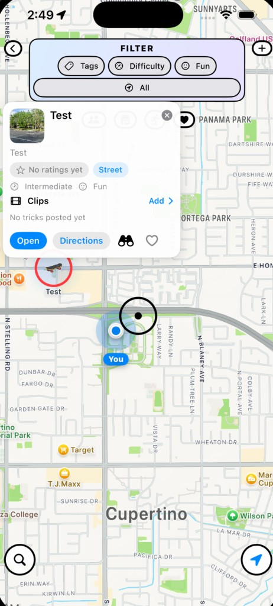
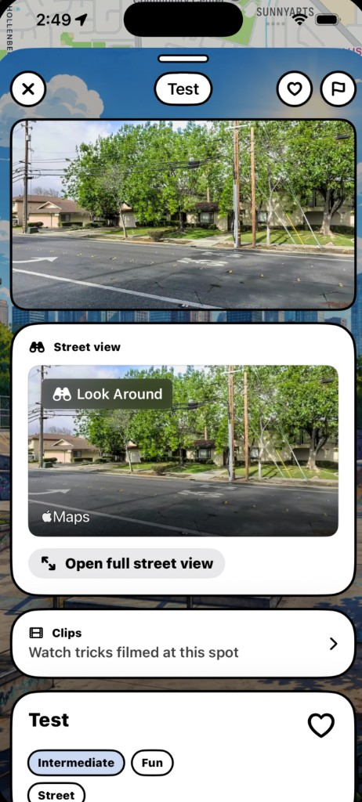
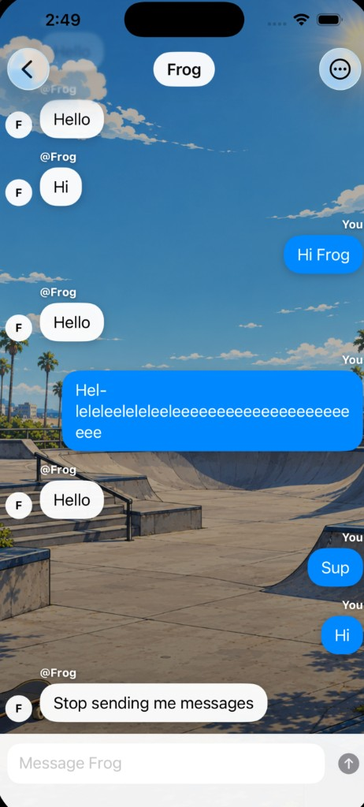
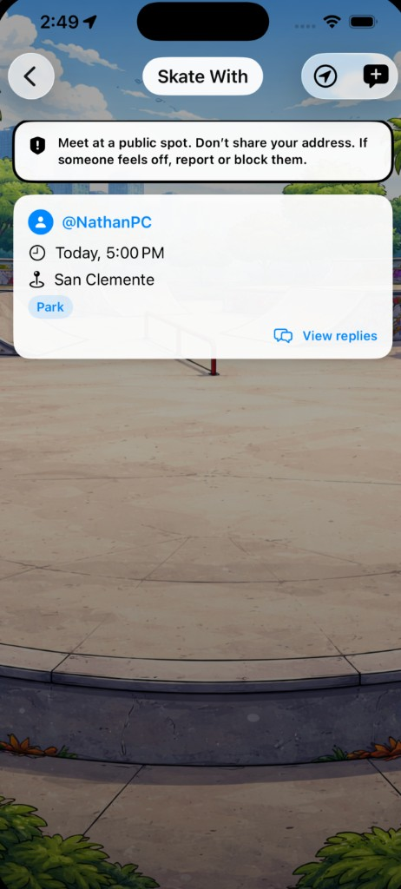
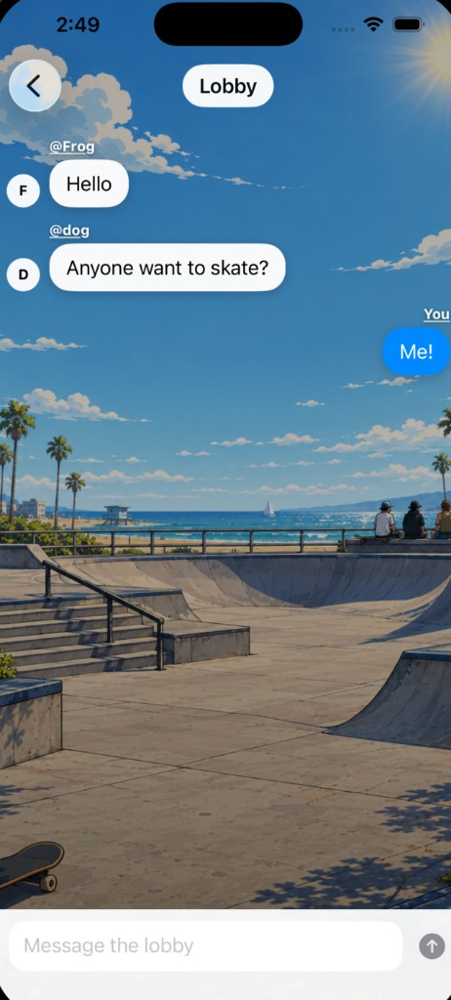

<p align="center">
  
</p>

# Streetline

Streetline is an iOS skate-spot app for finding, sharing, and talking about places to skate. Sign in, drop pins on a map, rate and comment on spots, save favorites, add friends, post when you want a session, and chat in the lobby.

iPhone only. Built with SwiftUI, MapKit, and Firebase.

## Features

- Email/password accounts with usernames, avatars, and a 13+ age check at signup
- Interactive map of community skate spots, with distance and tag filters
- Add spots with photos, tags, difficulty, and fun level
- Spot details: ratings, comments, photo gallery, trick clips, street view, directions, and reports
- Favorites list
- Friends, friend requests, and 1:1 chat, with unread badges on Home
- Skate With board for timed session posts and replies
- Global lobby chat (messages expire after 24 hours)
- Nearby skate shops and skate parks
- Report and block on posts, comments, clips, chat, and accounts
- Settings: username, email, skate profile, blocked users, delete account, and contact support

## How the app works

### Accounts and login

Open the app on the login screen. Sign in with email and password, or open **Sign Up**.

Sign up requires:

- Username (3–20 characters, letters, numbers, and underscores)
- Email
- Password and confirmation
- Birthday — you must be **13 or older**

After login, Streetline looks up your profile in Firestore:

- New accounts get a profile during sign up.
- Older accounts without a username are sent to a **Choose a username** screen (also requires a 13+ birthday) before home.
- Logout is in the home screen wrench menu. It signs you out of Firebase Auth and clears cached friends and blocked-user lists.

Your username is what other people see on spots, comments, posts, clips, and profiles.

### Home



Home is the hub after you log in. Background art shifts with time of day (including a night sky). The top bar has:

- **Friends** — your friends list, incoming requests, and pending outgoing requests. A red badge appears when you have unread chats or incoming friend requests.
- **Wrench menu** — Settings or Logout

| Control | Opens |
| --- | --- |
| **MAP** | Community skate-spot map |
| **SKATE WITH** | Session board (“looking to skate”) |
| **FAVORITES** | Spots you have hearted |
| **LOBBY** | Global chat |

### Map



The map loads skate spots from Firestore and centers on your location when location permission is granted. Without permission it starts near San Francisco. Use the location button to re-center on yourself, or search for a place to “travel” the map (filters then use that destination).

**Pins**

- Tap a pin to open a preview card (photo, name, description snippet, rating, tags, difficulty, fun level, clips).
- **Open** opens the full spot sheet.
- **Directions** opens Apple Maps.
- The heart on the card saves or removes the spot from favorites.
- Your own spots can be moved: long-press, then drag. Other people’s pins cannot be moved.

**Add a spot**

1. Pan the map so the center sits on the place you want to mark.
2. Tap **+**.
3. Fill in a name and description.
4. Optionally add a photo from your library (uploaded to Firebase Storage).
5. Pick tags, difficulty, and fun level.
6. Save. The spot is stored in Firestore with your user ID and username.

Tags: Street, Park, DIY, Ledge, Rail, Hubba, Bowl, Red Curb  
Difficulty: Beginner, Intermediate, Advanced  
Fun level: Not fun but skateable, Fun, Super Fun

**Filters**

The filter bar hides pins that do not match the selected tag, difficulty, fun level, and/or distance (2 / 5 / 10 / 25 miles, or All). Distance is measured from your GPS location, or from the travel destination if you searched the map. Choose **All tags**, **Any level**, **Any fun**, or **All** miles to clear a filter.

**Map shortcuts**

- Friends list
- Nearby skate shops
- Nearby skate parks
- Favorites
- Place search (travel the map)

### Spot details



The spot sheet is the full page for one pin.

- **Photos** — swipe through uploaded photos. The spot owner can add or delete photos.
- **Clips** — short trick videos from the photo library (under 40 MB). You can report or block a clip’s author. Only the uploader can delete their clip.
- **Favorite** — heart in the toolbar.
- **Rating** — 1–5 stars. The average and count come from a Firestore `ratings` subcollection. You can change your rating later.
- **Description, tags, difficulty, fun level** — set when the spot was created.
- **Street view** — Look Around / map snapshot when available, with a link to Google Street View.
- **Directions** — opens turn-by-turn directions in Apple Maps.
- **Creator** — tap `@username` to open that person’s profile.
- **Comments** — real-time thread on the spot. You can like or dislike a comment (one or the other). Report or block from the comment menu.
- **Report** — flag a spot as inappropriate, spam, wrong location, offensive, or other. Reports go to a Firestore `reports` collection.
- **Delete Spot** — only the owner can delete the pin (and its stored photos).

### Favorites

From Home or the map, open **Favorites** to see every spot you have hearted. Tap a row to open that spot’s detail sheet. Heart a spot again (on the map card or detail page) to remove it.

Favorites are stored on your user profile in Firestore, not only on the device.

### Friends and chat



Open **Friends** from Home or the map.

- **Requests** — accept or decline incoming friend requests.
- **Friends** — tap a friend to open their profile, or remove them. You can also start a chat from their profile. Unread chats show a **New** tag and a red dot on the message icon. Opening the conversation marks it as read.
- **Pending** — outgoing requests you have sent.
- **Add friend** — search by username prefix and send a request.

Profiles show avatar, username, join date, optional skate details (age, skill, favorite trick/skater), recent Skate With posts, and spots that person added. From someone else’s profile you can message them, send a friend request, report them, or block them. Blocking hides their posts, comments, clips, and messages.

**Chat** is a 1:1 thread. Opening a conversation creates or reuses a thread in Firestore and listens for new messages in real time. You can report the conversation or block the other person.

### Skate With



**Skate With** is a live board for session posts.

- Tap **+** to post when you want to skate, what (Street, Park, DIY, Bowl, Mini, or Mixed), and where (a map spot or a typed place). Optional extra text is allowed.
- The list updates in real time and can be filtered by distance (same 2 / 5 / 10 / 25 / All choices as the map).
- Posts hide 24 hours after the session time.
- Tap a post to read it and reply.
- Tap `@username` to open that profile.
- A safety note reminds people to meet in public, skip sharing their address, and report or block if something feels off.
- Report or block from the post or a reply.

Posts and replies are stored in Firestore and attributed to your username.

### Lobby



**Lobby** is a global chat for everyone who is signed in. Messages live for 24 hours, then they are treated as expired and cleaned up. Report or block from a message. Blocked users’ messages are hidden.

Lobby messages are stored as comments on a reserved `communityPosts/lobby` document so they use the same Firestore rules as Skate With replies.

### Nearby shops and parks

From the map, open the storefront or skateboarding icons. Each list has its own distance filter (2 / 5 / 10 / 25 miles, or All).

- **Skate shops** — Google Places search around the current map center (or travel destination). If Places is unavailable, MapKit is used as a fallback. Tap a result for directions in Apple Maps.
- **Skate parks** — same search for parks, plus a **User Pins** tab that lists Streetline spots in the area.

These lists need a Google Places API key in `Secrets.xcconfig` (`GOOGLE_PLACES_API_KEY`). Without a key, Streetline falls back to Apple Maps search.

### Settings and support

Settings (home wrench menu) shows your avatar, `@username`, and email.

- Tap the photo to upload a new avatar (Firebase Storage).
- **Change username** updates the name stored on your profile and the denormalized `@username` on spots, Skate With posts, replies, lobby messages, and clips you created.
- **Change email** updates Firebase Auth and the profile document (requires your current password).
- **Skate profile** — optional public age (13–99), skill level, favorite trick, and favorite skater.
- **Blocked users** — list and unblock.
- **Delete account** — requires your password and typing DELETE. Removes your Auth user, profile, spots, photos, clips, posts, messages, and related Firestore/Storage data. The shared lobby document is kept.
- **Privacy Policy** opens [Streetline-Privacy](https://github.com/NateJoshuaSmith/Streetline-Privacy).
- **Contact Support** opens a form. Subject and message are required; **Open in Mail** drafts an email to `streetlinesupport@gmail.com` that includes the app version. You can also copy the support address.

## Safety

Streetline is user-generated. You can report spots, posts, replies, lobby messages, clips, chats, and accounts. Reports are stored in Firestore for review. Blocking hides that person’s content from you. Skate With includes an in-app reminder to meet in public.

## Tech stack

- **SwiftUI** — UI and navigation
- **MapKit** — map, camera, Look Around / snapshots, and Apple Maps directions
- **Core Location** — user location
- **PhotosUI** — photo and video library picks
- **Firebase Auth** — email/password accounts
- **Cloud Firestore** — spots, profiles, friends, chats, Skate With posts, comments, ratings, clips metadata, reports, lobby
- **Firebase Storage** — spot photos, avatars, and trick clips
- **Google Places API (New)** — optional nearby shops and parks (MapKit fallback without a key)

The iOS app talks to Google’s Firebase project at runtime (Auth, Firestore, and Storage). Security rules in this repo (`firestore.rules`, `storage.rules`) must be published in the Firebase console so those calls are locked down. There is no separate App Store backend.

## Project structure

```
Streetline/
├── Streetline/
│   ├── StreetlineApp.swift      # App entry, login vs home vs username setup
│   ├── Info.plist               # Places key placeholder ($(GOOGLE_PLACES_API_KEY))
│   ├── GoogleService-Info.plist # Firebase iOS config
│   ├── Models/                  # Spot, user, message, post, report, age/username rules
│   ├── Views/                   # Screens (map, home, friends, Skate With, lobby, …)
│   ├── ViewModels/              # Login / session
│   └── Services/                # Firebase, location, Places
├── StreetlineTests/             # Unit tests (usernames, age, nearby-place filters, models)
├── firestore.rules              # Firestore security rules
├── storage.rules                # Storage security rules
├── firestore.indexes.json
├── firebase.json
├── docs/screenshots/          # README and store preview shots
└── Streetline.xcodeproj
```

## Getting started

1. Clone the repository.
2. Open `Streetline.xcodeproj` in Xcode.
3. Confirm Firebase:
   - `Streetline/GoogleService-Info.plist` is in the app target.
   - Email/Password is enabled in Authentication.
   - Firestore and Storage are enabled.
   - Publish `firestore.rules` and `storage.rules` to the Firebase project (Firestore → Rules and Storage → Rules, or `firebase deploy --only firestore:rules,storage`).
4. (Optional) Copy `Secrets.xcconfig.example` to `Secrets.xcconfig` and set `GOOGLE_PLACES_API_KEY`. Restrict that key in Google Cloud to the Places API and bundle ID `Streetline.Streetline`. That powers nearby shops and parks; without it, those lists use Apple Maps search.
5. Build and run on an iPhone simulator or device. Location features work best on a device.

## Requirements

- Xcode 15 or later
- iOS 17 or later
- iPhone (the target is iPhone-only; it can still run scaled on iPad)
- Firebase project (Auth, Firestore, Storage) with the repo rules published
- Google Cloud Places API key (optional, for nearby shops and parks)
